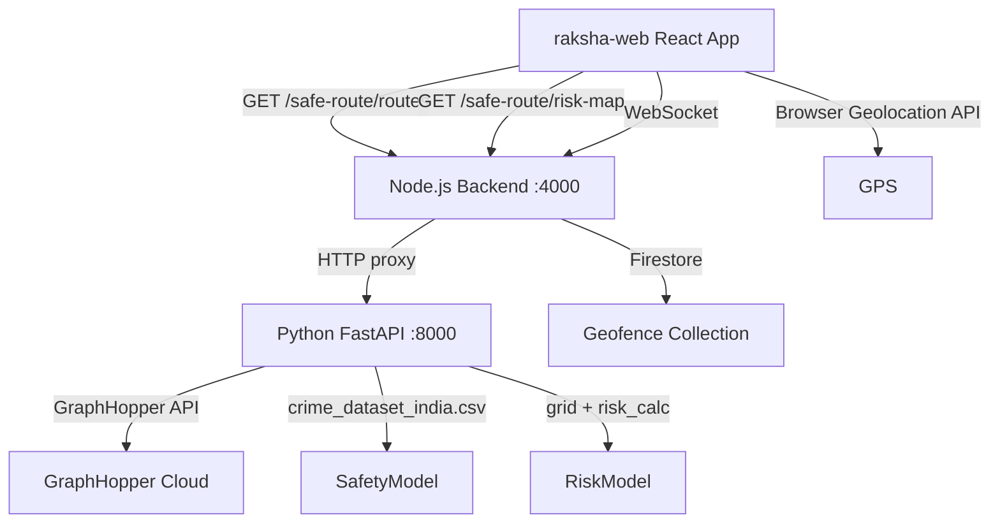

# Design Document: Safe Route Integration

## Overview

This feature integrates the standalone Python/FastAPI safe route microservice into the Raksha ecosystem. The integration adds a new **Safe Route** page to `raksha-web`, a proxy route in the Node.js backend, and a risk-aware enhancement to the geofence breach system. The user's live GPS location drives the map center, the heatmap, and the hotspot warning banner — keeping everything in sync automatically.

---

## Architecture



The Python service runs as a sidecar process alongside the Node.js backend. The Node.js backend acts as an authenticated proxy — the frontend never calls the Python service directly. This keeps CORS handling centralized and ensures all requests are authenticated.

---

## Components and Interfaces

### 1. Node.js Proxy Route (`Raksha/src/routes/safeRoute.ts`)

A new Express router mounted at `/safe-route`. It uses Node's built-in `fetch` (or `node-fetch`) to forward requests to the Python service.

```typescript
// Endpoints exposed:
GET /safe-route/routes?source=...&destination=...&hour=...
GET /safe-route/risk-map?hour=...
```

Both endpoints require the existing `requireAuth` JWT middleware. On Python service failure, they return HTTP 503.

### 2. Frontend API Client Extension (`raksha-web/src/api/client.ts`)

Two new methods added to the existing `api` client:

```typescript
export const safeRouteApi = {
  routes: (source: string, destination: string, hour?: number) =>
    api(`/safe-route/routes?source=${encodeURIComponent(source)}&destination=${encodeURIComponent(destination)}${hour != null ? `&hour=${hour}` : ''}`),
  riskMap: (hour?: number) =>
    api(`/safe-route/risk-map${hour != null ? `?hour=${hour}` : ''}`),
};
```

### 3. Safe Route Page (`raksha-web/src/pages/SafeRoute.tsx`)

A new React page component. Key responsibilities:

- Requests geolocation on mount; places a user marker and centers the map
- Loads the risk heatmap on mount (and on hour change) using `leaflet.heat`
- Renders hotspot circle markers with risk-score popups
- Checks if the user's current position is inside any hotspot cell
- Shows a warning banner when inside a hotspot
- Accepts source/destination/hour inputs and fetches routes on button click
- Renders color-coded polylines and route info cards

### 4. BottomNav Update (`raksha-web/src/components/BottomNav.tsx`)

Add a 6th tab: `{ path: '/safe-route', icon: '🗺️', label: 'Safe Route' }`.

### 5. App Router Update (`raksha-web/src/App.tsx`)

Register `<Route path="/safe-route" element={<SafeRoute />} />` inside `ProtectedLayout`.

### 6. Geofence Service Enhancement (`Raksha/src/services/geofenceService.ts`)

Add a helper `isLocationInHotspot(lat, lng, hotspots)` that checks if a coordinate falls within any hotspot cell (using a bounding-box approximation with a ~300m cell radius). The `checkGeofenceBreach` function calls the Node proxy's risk-map data (cached in memory, refreshed hourly) and sets `highRisk: true` in the breach payload when the breached location overlaps a hotspot.

---

## Data Models

### Route (from Python service)
```typescript
interface Route {
  route_id: number;
  distance_km: number;
  duration_min: number;
  safety_score: number;   // 0.0–1.0, lower is safer
  coords: [number, number][];  // [lat, lng] pairs
}
```

### RiskCell (from Python service)
```typescript
interface RiskCell {
  lat: number;
  lon: number;
  risk: number;       // 0.0–1.0
  is_hotspot: boolean; // risk > 0.7
}
```

### GeofenceBreachEvent (WebSocket payload, extended)
```typescript
interface GeofenceBreachEvent {
  userId: string;
  breachedZones: string[];
  lat: number;
  lng: number;
  highRisk: boolean;   // NEW: true if location overlaps a hotspot
  createdAt: string;
}
```

---

## Correctness Properties

*A property is a characteristic or behavior that should hold true across all valid executions of a system — essentially, a formal statement about what the system should do. Properties serve as the bridge between human-readable specifications and machine-verifiable correctness guarantees.*

### Property 1: Safety score to color mapping is total and correct

*For any* safety score value in [0.0, 1.0], the `safetyScoreToColor` function should return exactly one of `"green"`, `"orange"`, or `"red"`, with green for scores ≤ 0.3, orange for scores ≤ 0.6, and red for scores > 0.6.

**Validates: Requirements 1.4**

---

### Property 2: Route info rendering contains all required fields

*For any* array of Route objects, the rendered route info cards should each contain the route's `distance_km`, `duration_min`, and `safety_score` values as visible text.

**Validates: Requirements 1.5**

---

### Property 3: Hotspot marker count matches hotspot cell count

*For any* risk-map response, the number of circle markers rendered on the map should equal the number of cells where `is_hotspot === true`.

**Validates: Requirements 2.3**

---

### Property 4: Map centers on current location

*For any* valid GPS coordinate pair (lat, lng), when the geolocation API resolves with those coordinates, the Leaflet map's center should be set to that same (lat, lng).

**Validates: Requirements 2.6, 3.2**

---

### Property 5: Position update threshold — 50 meter rule

*For any* two coordinate pairs (prev, next), the user marker and map center should only update when the haversine distance between prev and next exceeds 50 meters.

**Validates: Requirements 3.4**

---

### Property 6: Hotspot containment drives banner visibility

*For any* current location and risk-map data, the warning banner should be visible if and only if `isLocationInHotspot(lat, lng, hotspots)` returns `true`.

**Validates: Requirements 4.1, 4.2, 4.3**

---

### Property 7: Backend highRisk flag matches hotspot containment

*For any* geofence breach event with coordinates (lat, lng) and a set of hotspot cells, the `highRisk` flag in the breach payload should equal the result of `isLocationInHotspot(lat, lng, hotspots)`.

**Validates: Requirements 4.5**

---

## Error Handling

| Scenario | Behavior |
|---|---|
| Geolocation denied / unavailable | Show fallback message; default map center to Mumbai (19.07, 72.87) |
| Python service unreachable | Node proxy returns 503; frontend shows "Route service unavailable" toast |
| No routes returned | Frontend shows "No routes found for this journey" message |
| Risk-map fetch fails | Heatmap silently skipped; no crash; console warning logged |
| Invalid hour input (< 0 or > 23) | Frontend clamps to valid range before sending |

---

## Testing Strategy

### Unit Tests
- `safetyScoreToColor(score)` — test boundary values (0, 0.3, 0.31, 0.6, 0.61, 1.0)
- `isLocationInHotspot(lat, lng, cells)` — test point inside cell, point outside, empty cells array
- Node proxy route — mock `fetch` to Python service; verify parameter forwarding and 503 on failure
- Geofence `highRisk` flag — unit test the enhanced `checkGeofenceBreach` with mocked hotspot data

### Property-Based Tests

Using **fast-check** (already compatible with the TypeScript/Vitest stack).

Each property test runs a minimum of **100 iterations**.

Tag format: `Feature: safe-route-integration, Property N: <property_text>`

- **Property 1** — Generate random floats in [0, 1]; assert color is one of the three valid values and matches the correct range.
- **Property 2** — Generate random Route arrays; render and assert all fields present.
- **Property 3** — Generate random RiskCell arrays with random `is_hotspot` flags; assert marker count equals hotspot count.
- **Property 4** — Generate random valid coordinates; mock geolocation; assert map center equals input.
- **Property 5** — Generate random coordinate pairs; compute haversine distance; assert update only when distance > 50m.
- **Property 6** — Generate random coordinates and hotspot arrays; assert banner visibility matches `isLocationInHotspot` result.
- **Property 7** — Generate random breach coordinates and hotspot arrays; assert `highRisk` flag matches `isLocationInHotspot` result.
